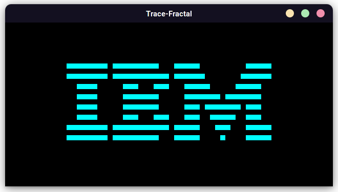
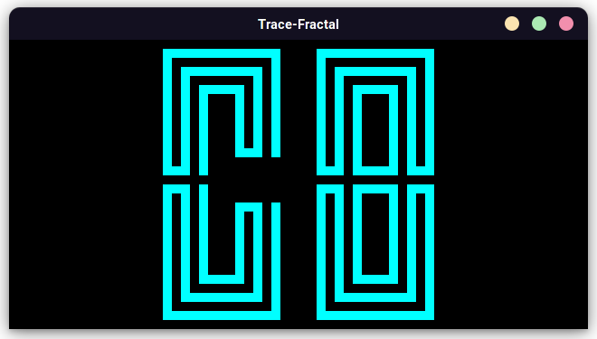
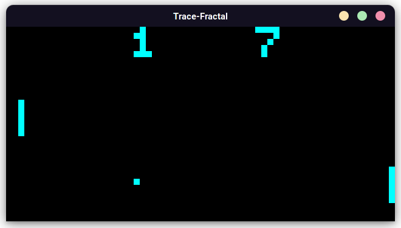

# Welcome!

Trace-Fractal is an emulator based on the the CHIP-8 virtual machine written in Python.

Currently, i have only implemented the normal
CHIP-8 instructions, but i am working on adding more super C8's instructions too.

# Screenshots:

### IBM logo

### CHIP-8 logo

### Me playing pong :D

# Resources Used:

- [Cowgod's techincal documentation](http://devernay.free.fr/hacks/chip8/C8TECH10.HTM)
- [Free Code Camp's Tutorial](https://www.freecodecamp.org/news/creating-your-very-own-chip-8-emulator/)

and a few open source projects.
